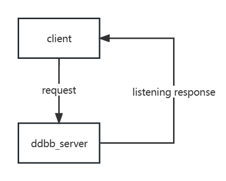
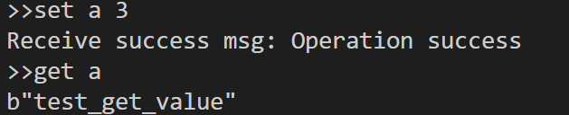
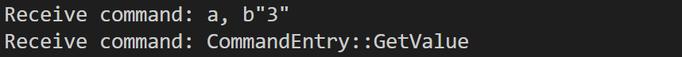

# The deep dive of ddbb

> A distributed key-value store similar to etcd

### Data frame

> As we all know, network connections like TCP connection mostly are byte stream. The byte stream, in our system, should be converted into `frames`. Each `frame` is a data unit. The frame has no semantics except data. Command parsing and implementation will be performed at a higher level (compared with frame parsing level, thinking about HTTP).

The basic structure of Frame looks like this:

```rust
enum Frame {
    Simple(String),
    Error(String),
    Integer(u64),
    Bulk(Bytes),
    Null,
    Array(Vec<Frame>),
}
```

#### Bytes to Frame 

`ddbb` use a series of encodeing tags to cast bytes into `frame` which are similar to the protocol used by `redis`, to see details: [RESP protocol spec | Redis](https://redis.io/docs/reference/protocol-spec/)

APIs supplied by: 

- `Frame::check()`
- `Frame::parse()`
- `Frame::deserialize()`

#### Frame to Bytes

APIs supplied by:

- `Frame::serialize()`

### Data structure

`ddbb` has different data structures for different view of the system.

```rust
/// For ddbb user.
pub enum DataEntry {}

/// For omni-paxos.
pub enum LogEntry {}

/// For ddbb_client and ddbb_sever.
pub enum CommandEntry {}

/// For ddbb_client and ddbb_server
pub enum MessageEntry {}
```

 In order to transport data using network connection, such data structures shoud be casted to `frame` and then to bytes.

### Connection

`ddbb` uses `tokio::net::TcpStream` to build network connection, but can be replaced by any interface of bytes stream.

The structure of data transported by network looks like this:


### Client

Basically, the client of ddbb continuously listens to input from user in a loop and parses that input into a command entry. So far, we have implemented Set and Get request.

```Rust
enum CommandEntry {
    SetValue {
        key: String,
        value: Bytes,
    },
    GetValue {
        key: String,
    },
    Empty,
}
```

The command will be sent to server and then wait for response, all transferring data are packed into the data structure *Frame*.



#### Message Listening

```Rust
async fn message_receiver(mut receiver: mpsc::Receiver<(&str, Vec<u8>)>) 
```

Here we use an asynchronized function *message_receiver* to listen to the response returned by server. The function receives messages through a Rust `mpsc` channel and processes the messages received by decoding them using `bincode`, then performs different actions depending on the type of the message. If the message is a "peers" message, the function updates a count of the number of active nodes. If the message is a "put" or "get" message, the function determines which node should handle the message based on the key in the message, connects to that node using a `TcpStream`, and sends the message. If the message type is not recognized, the function prints an error message.

The function reads bytes stored in receiver buffer and checks which the message type is, which is asynchronized and guarantees ordered data transferring. 

#### Test result

Client



Server


