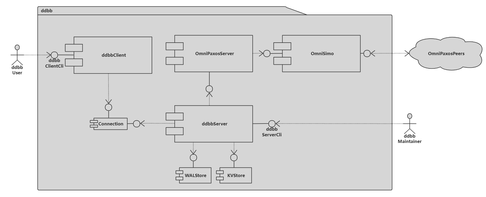
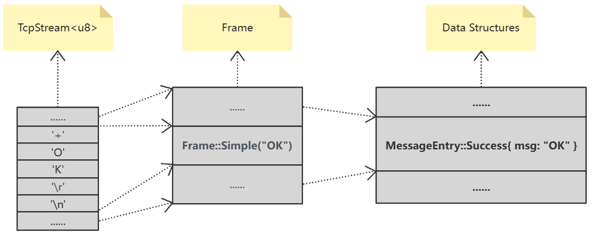
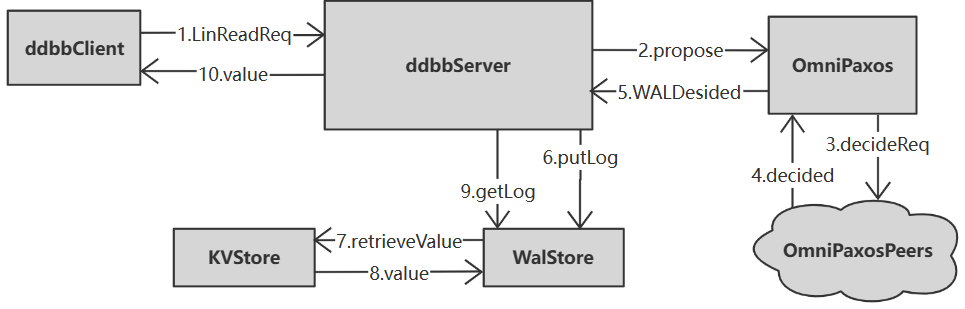

# The deep dive of DDBB

> A distributed key-value store inspired by etcd

## System architecture



## Connection layer: OmniSIMO

>Omni Simo: a single incoming and multiple outgoing connection module for OmniPaxos instances' communication. 
>
>Which is the most important part of our project. 

### Architecture


### Data frame

> Code: ddbb_libs/src/frame.rs

As we all know, network connections like TCP connection mostly are byte stream. The byte stream, in our system, should be converted into `frames`. Each `frame` is a data unit. The frame has no semantics except data. Command parsing and implementation will be performed at a higher level (compared with frame parsing level, thinking about HTTP).

The basic structure of Frame looks like this:

```rust
enum Frame {
    Simple(String),
    Error(String),
    Integer(u64),
    Bulk(Bytes),
    Null,
    Array(Vec<Frame>),
}
```

#### Bytes to Frame 

`ddbb` use a series of encodeing tags to cast bytes into `frame` which are similar to the protocol used by `redis`, to see details: [RESP protocol spec | Redis](https://redis.io/docs/reference/protocol-spec/)

APIs supplied by:

- `Frame::check()`
- `Frame::parse()`
- `Frame::deserialize(byets: Bytes) -> Frame`

#### Frame to Bytes

APIs supplied by:

- `Frame::serialize() -> Bytes`

### Connection

> Code: ddbb_libs/src/frame.rs

The `Connection` model is to build an one2one network connection between two nodes. Based on `tokio::net::TcpStream`.

#### Interface

- **Init**

  ```rust
  pub fn new(tcp_socket: TcpStream) -> Connection {
      Connection {
          stream: BufWriter::new(tcp_socket),
          buffer: BytesMut::with_capacity(4 * 1024),
      }	
  }
  ```

- **Frame oriented write and read**

  The `Connection` is a higher abstraction of pure network bytes stream channel, only supply `Frame` oriented write and read.

  ```rust
  fn read_frame() -> Frame {}
  
  fn write_frame(frame: &Frame) -> Result<()> {}
  ```

#### Reconnect

One of the good aspects of `Connection` is that it supply failure recovery with `reconnect` function:

```rust
pub async fn reconnect(&mut self, addr: String) -> Result<()> {
    // loop until reconnected
    loop {
        if let Ok(tcp_stream) = TcpStream::connect(&addr).await {
			//code..
        };
        sleep(Duration::from_millis(RECONNECT_INTERVAL)).await;
    }
}
```

When reconnected, it will send a `RECONNECT_MSG` to the other side and to the applicatoin layer, which will be used to implement `OmniPaxos` failure recovery later.

```rust
const RECONNECT_MSG: &str = "##RECONNECT";
//code..
let reconn_msg = Frame::Error(RECONNECT_MSG);
```

### Data structure of DDBB

> Code: ddbb_libs/src/data_structure.rs 

`ddbb` has different data structures for different view of the system.

```rust
/// For ddbb user.
pub enum DataEntry {}

/// For omni-paxos.
pub enum LogEntry {}

/// For ddbb_client and ddbb_sever.
pub enum CommandEntry {}

/// For ddbb_client and ddbb_server
pub enum MessageEntry {}
```

 In order to transport data using network connection, such data structures shoud be casted to `frame` and then to bytes.

APIs supplied by:

```rust
pub trait FrameCast {
    fn to_frame(&self) -> Frame;

    fn from_frame(frame: &Frame) -> Result<Box<Self>, Error>;
}

impl FrameCast for MessageEntry{
    // more code...
}
```

### Data transmission

`ddbb` uses `tokio::net::TcpStream` to build network connection, but can be replaced by any interface of bytes stream.

The structure of data transported by network looks like this:



### OmniSimo

> Code: ddbb_server/src/omni_paxos_server/op_connection.rs

The single incoming and multiple outgoing group communication connection model for OmniPaxos instances' communication.

#### Interface

OmniSimo expose two interface:

```rust
pub fn send_message(&self, omni_message: &OmniMessage) {}

pub async fn receive_message(simo: Arc<Mutex<OmniSIMO>>) -> Result<OmniMessage> {}
```

The reason why `send_message` is a sync funtcion but `receive_message` is not is that the `send_message` only writes msg into buffer, so there is no needs for it to be async.

#### Start up

When `OmniSimo` starts up, it will wait for a **quorum** to be connected to make sure of that `OmniPaxos` can start up safely.

```rust
if connected.len() >= (peers.len() + 1 ) / 2 + 1 {
    return Ok(());
}
```

#### Msg buffer

OmniSimo uses two buffer to caching incoming and outgoing messages.

```rust
type OmniMessageBuf = Arc<Mutex<VecDeque<OmniMessage>>>;
// code....
pub outgoing_buffer: OmniMessageBuf,
pub incoming_buffer: OmniMessageBuf,
```

The sender and receiver thread will periodically retrieve message from the buffer:

```rust
loop {
    {
        if let Some(outgoing_message) = outgoing_buffer.lock().unwrap().pop_front() {
            // send message
            }
        }
    }
    // sleep for while before second retrieving
    sleep(Duration::from_millis(100)).await;
}
```

#### Group membership management

Infomation of the communication group membership is defined during the init phase of `OmniSIMO`:

```rust
pub struct OmniSIMO {
    self_addr: String,
    /// #Example: nodeid: 6, addr: "127.0.0.1:25536"
    peers: <NodeId, String>,
    connected: <Vec<NodeId>>,
	// code..
}
```

The `OmniSIMO::connected` attribute is used to maintain the connected (or correct) peers, it will change when peers up and down. Besides, since we have multiple outging channels, which are `sender`s, but only one outging buffer, when each sender retrieve message from outgoing buffer and want to send it out, it need to filter such message that does not belong to itself, or even does not belong to any connected peer:

```rust
// can be sent by the current sender
let mut can_send = false;
// can discard current msg, it happens when the msg dose not belong to any connected peer
let mut can_discard = false;
if let Some(msg) = buf.front() {
    if !connected.contains(&msg.get_receiver()) {
        can_discard = true;
    } else if msg.get_receiver() == reveiver_id_of_current_sender {
        can_send = true;
    }
}
// code..
```

#### Failure recovery

When connection lost or peer down, OmniSIMO will start corresponding `reconnect` process

```rust
// disconnnected
connected.retain(|&x| x != reveiver_id);
// try to reconnect
connection.reconnect(reveiver_addr).await;
// reconnected
connected.insert(0, reveiver_id);
```

## OmniPaxos server

Similar structure with the OmniPaxos in `omnipaxos/examples/kv_store`:

```rust
pub struct OmniPaxosServer {
    pub omni_paxos_instance: OmniPaxosInstance,
    pub omni_simo: OmniSIMO,
}

impl OmniPaxosServer {
    async fn send_outgoing_msgs(&mut self) {
        // code..
    }
    pub(crate) async fn run(&mut self) {
        // code..
    }
}
```

## DDBB core

> Code: ddbb_server/src/ddbb_server.rs

### Local storage

#### WAL Store

The WAL (write ahead log) store is to store all log entries decided by the `OmniPaxos`.

```rust
struct WALStore {
    dicided_len: u64,
    store: Vec<LogEntry>,
}
```

#### KVStore

The this is the storage of K-V entries, which is built by filtering the logs in the `WALSore`.

```rust
struct KVStore {
    store: HashMap<String, Vec<u8>>,
}
```

### Basic operation

#### Set and Get

Basic `set` and `get` operation supply **Sequential Consistency**. Which were implemented by `WRITE MAJORITY READ LOCAL` algorithm.

```rust
ddbb.set("key", Vec::from([1])).unwrap();
ddbb.get("key")
```

#### LinWrite and LinRead

These two operations supply **Linearizability**, which were implemented by `WRITE MAJORITY READ MAJORITY` algorithm. The DDBB uses `(NodeIpAddr, Timestamp)` to identify each operation:

```rust
pub enum LogEntry {
    LINRead {
        opid: (String, u64),
		// code ...
    },
    LINWrite {
        opid: (String, u64),
		// code ...
    },
}
```

The log of `LinRead` operation will also be stored in the `WALStore` with the value of this operation (same as `LinWrite`) to guarantee linearzability, like this:

```shell
LINWrite { opid: ("127.0.0.1:6550", 2), key: "key1", value: [1, 2] }
LINWrite { opid: ("127.0.0.1:6552", 1), key: "key2", value: [2, 2] }
```

The operation handler will periodically retrieve log from `WALStore` until got the value of operation times out:

```rust
async fn lin_read(key: String) -> Result<Vec<u8>>{
    // code...
    loop {
        {
            if let Some(log) = ddbb.find_log_by_opid(self_addr.clone(), ts) {
                    return Ok(value);
            };
        }
        // code...
        
        // operation timesout
        if times >= LIN_WRITE_TIMES_OUT {
            return Err("Lin read failed".into());
        }
        sleep(LOG_RETRIEVE_INTERVAL).await;
    }
}
```

The whole workflow of `LinRead` looks like this:




## ### A Big Defect With tikio::select!

### Description

Take a look at this case:

```rust
#[tokio::main]
async fn main() {
    let async_blocking = async { loop {}; };
    let async_task = async { println!("ss"); };
    tokio::select! {
        _ = async_task => {}
        _ = async_blocking => {}
    }
}
```

The `async_blocking` is a blocking async code block and the `async_task` is a non-blocking async task. With `tokio::select!` we can expect that one of the async tasks inside the `select!` will finish and the program will make progress (in this case, the`async_task` will always finish and program will return). **But the answer is NO!** 

### Analyses

As the description in the document of `tokio::select`:

> By running all async expressions on the current task, the expressions are able to run **concurrently** but not in **parallel**. This means **all expressions are run on** **the same thread** and if one branch blocks the thread, all other expressions will be unable to continue. If parallelism is required, spawn each async expression using `tokio::spawn` and pass the join handle to `select!`.

Which means in this case, the answer about if the program can make progress depends on which task will be chosen firstly to be  executed. So the program will have 50% chance to be blocking!

### Solution

- **Use `biased`**

  We can use `biased` key word, and put the task which is likely to be blocking to the last of the task list.

  ```rust
  #[tokio::main]
  async fn main() {
      let async_blocking = async { loop {}; };
      let async_task = async { println!("ss"); };
      tokio::select! {
          biased;
          _ = async_task => {}
          _ = async_blocking => {}
      }
  }
  ```

- **Make the execution parallel**

  ```rust
  #[tokio::main]
  async fn main() {
      let async_blocking = async { loop {}; };
      let async_task = async { println!("ss"); };
      tokio::select! {
          biased;
          _ = tokio::spawn(async_blocking) => {} 
          _ = async_task => {}
      }
  }
  ```


### ❗Things even worse in `#[tokio::test]`

There must not be any blocking async task in `#[tokio::test]` function (like the `async_blocking` above) cause `tokio::test` using a single thread model, which means the `tokio::test` program will always be blocking if there is a blocking operation in the code.

