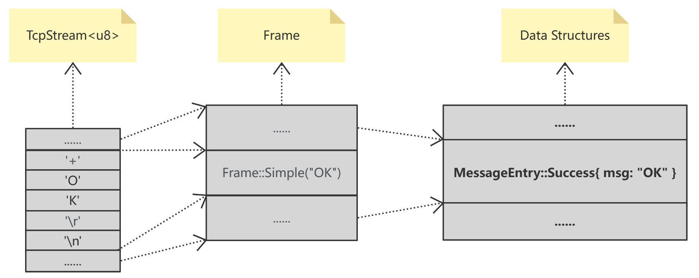

# The deep dive of ddbb

> A distributed key-value store similar to etcd

### Data frame

> As we all know, network connections like TCP connection mostly are byte stream. The byte stream, in our system, should be converted into `frames`. Each `frame` is a data unit. The frame has no semantics except data. Command parsing and implementation will be performed at a higher level (compared with frame parsing level, thinking about HTTP).

The basic structure of Frame looks like this:

```rust
enum Frame {
    Simple(String),
    Error(String),
    Integer(u64),
    Bulk(Bytes),
    Null,
    Array(Vec<Frame>),
}
```

#### Bytes to Frame 

`ddbb` use a series of encodeing tags to cast bytes into `frame` which are similar to the protocol used by `redis`, to see details: [RESP protocol spec | Redis](https://redis.io/docs/reference/protocol-spec/)

APIs supplied by: 

- `Frame::check()`
- `Frame::parse()`
- `Frame::deserialize()`

#### Frame to Bytes

APIs supplied by:

- `Frame::serialize()`

### Data structure

`ddbb` has different data structures for different view of the system.

```rust
/// For ddbb user.
pub enum DataEntry {}

/// For omni-paxos.
pub enum LogEntry {}

/// For ddbb_client and ddbb_sever.
pub enum CommandEntry {}

/// For ddbb_client and ddbb_server
pub enum MessageEntry {}
```

 In order to transport data using network connection, such data structures shoud be casted to `frame` and then to bytes.

### Connection

`ddbb` uses `tokio::net::TcpStream` to build network connection, but can be replaced by any interface of bytes stream.

The structure of data transported by network looks like this:



## ### A Big Defect With tikio::select!

### Description

Take a look at this case:

```rust
#[tokio::main]
async fn main() {
    let async_blocking = async { loop {}; };
    let async_task = async { println!("ss"); };
    tokio::select! {
        _ = async_task => {}
        _ = async_blocking => {}
    }
}
```

The `async_blocking` is a blocking async code block and the `async_task` is a non-blocking async task. With `tokio::select!` we can expect that one of the async tasks inside the `select!` will finish and the program will make progress (in this case, the`async_task` will always finish and program will return). **But the answer is NO!** 

### Analyses

As the description in the document of `tokio::select`:

> By running all async expressions on the current task, the expressions are able to run **concurrently** but not in **parallel**. This means **all expressions are run on** **the same thread** and if one branch blocks the thread, all other expressions will be unable to continue. If parallelism is required, spawn each async expression using `tokio::spawn` and pass the join handle to `select!`.

Which means in this case, the answer about if the program can make progress depends on which task will be chosen firstly to be  executed. So the program will have 50% chance to be blocking!

### Solution

- **Use `biased`**

  We can use `biased` key word, and put the task which is likely to be blocking to the last of the task list.

  ```rust
  #[tokio::main]
  async fn main() {
      let async_blocking = async { loop {}; };
      let async_task = async { println!("ss"); };
      tokio::select! {
          biased;
          _ = async_task => {}
          _ = async_blocking => {}
      }
  }
  ```

- **Make the execution parallel**

  ```rust
  #[tokio::main]
  async fn main() {
      let async_blocking = async { loop {}; };
      let async_task = async { println!("ss"); };
      tokio::select! {
          biased;
          _ = tokio::spawn(async_blocking) => {} 
          _ = async_task => {}
      }
  }
  ```

  
