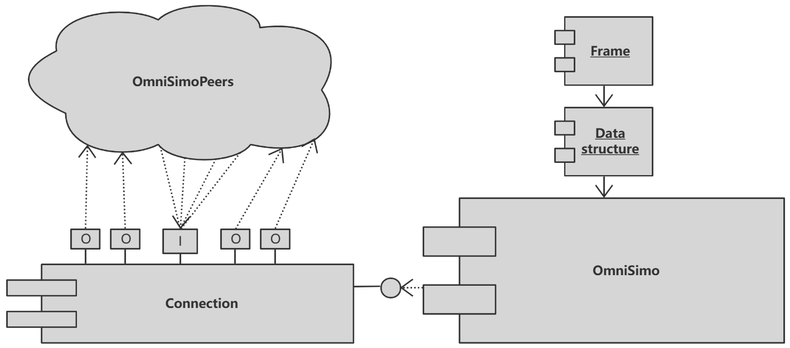

# DDBB

> A distributed key-value store inspired by etcd.
>
> [Git Hub Link](https://github.com/Mingxue-Zhang/ID2203--Distributed-Coordination-Service)

## 1 Introduction

Our goal is to build a etcd-like system with Omni-Paxos. We achieved a k-v store functionality and it guaranteens both Serializable and Linearizable operations. We also completed several testing related performance and complare our solution with etcd. At the end of the day, we can say our system, DDBB, can reach 20% of the performance of etcd.

### 1-1 Project group info

| Name          | Email           |
| ------------- | --------------- |
| Xinlong Han   | xinlong@kth.se  |
| Mingxue Zhang | mingxue@kth.se  |
| Zhengjin Wang | zhengjin@kth.se |

## 2 System Overview

> Below are all the information that you need to overally evaluate this project :)

### 2-1 Functions

- Stable and high-performance connection layer implementation for OmniPaxos, which is using failure-recovery model.
- Linearizable read and write, sequential read and write, delete operations on a KV store.
- Crash recovery when majority connected.
- Tolerates and recovers from partial connectivity.
- Snapshots and compacts.

### 2-2 Testing

- Completed unit testing for all the components.
- Parallel operation input testing and global trace analyses for linearizability.
- Randomly nodes down and recover testing for crash recovery.
- Randomly connection cut off and consistency analyses for partial connectivity tolerance.
- Benchmark testing and etcd comparation

## 3 Design and implementation

### 3-1 System architecture


### 3-2 Connection layer: OmniSIMO

>Omni Simo: a single incoming and multiple outgoing connection module for OmniPaxos instances' communication.
>
>Which is the most important part of our project.

#### 3-2-1 Architecture



#### 3-2-2 Data frame

> Code: ddbb_libs/src/frame.rs

As we all know, network connections like TCP connection mostly are byte stream. The byte stream, in our system, should be converted into `frames`. Each `frame` is a data unit. The frame has no semantics except data. Command parsing and implementation will be performed at a higher level (compared with frame parsing level, thinking about HTTP).

The basic structure of Frame looks like this:

```rust
enum Frame {
    Simple(String),
    Error(String),
    Integer(u64),
    Bulk(Bytes),
    Null,
    Array(Vec<Frame>),
}
```

##### Bytes to Frame

`ddbb` use a series of encodeing tags to cast bytes into `frame` which are similar to the protocol used by `redis`, to see details: [RESP protocol spec | Redis](https://redis.io/docs/reference/protocol-spec/)

APIs supplied by:

- `Frame::check()`
- `Frame::parse()`
- `Frame::deserialize(byets: Bytes) -> Frame`

##### Frame to Bytes

APIs supplied by:

- `Frame::serialize() -> Bytes`

#### 3-2-3 Connection

> Code: ddbb_libs/src/frame.rs

The `Connection` model is to build an one2one network connection between two nodes. Based on `tokio::net::TcpStream`.

##### Interface

- **Init**

  ```rust
  pub fn new(tcp_socket: TcpStream) -> Connection {
      Connection {
          stream: BufWriter::new(tcp_socket),
          buffer: BytesMut::with_capacity(4 * 1024),
      } 
  }
  ```

- **Frame oriented write and read**

  The `Connection` is a higher abstraction of pure network bytes stream channel, only supply `Frame` oriented write and read.

  ```rust
  fn read_frame() -> Frame {}
  
  fn write_frame(frame: &Frame) -> Result<()> {}
  ```

##### Reconnect

One of the good aspects of `Connection` is that it supply failure recovery with `reconnect` function:

```rust
pub async fn reconnect(&mut self, addr: String) -> Result<()> {
    // loop until reconnected
    loop {
        if let Ok(tcp_stream) = TcpStream::connect(&addr).await {
   //code..
        };
        sleep(Duration::from_millis(RECONNECT_INTERVAL)).await;
    }
}
```

When reconnected, it will send a `RECONNECT_MSG` to the other side and to the applicatoin layer, which will be used to implement `OmniPaxos` failure recovery later.

```rust
const RECONNECT_MSG: &str = "##RECONNECT";
//code..
let reconn_msg = Frame::Error(RECONNECT_MSG);
```

#### 3-2-3 Data structure of DDBB

> Code: ddbb_libs/src/data_structure.rs

`ddbb` has different data structures for different view of the system.

```rust
/// For ddbb user.
pub enum DataEntry {}

/// For omni-paxos.
pub enum LogEntry {}

/// For ddbb_client and ddbb_sever.
pub enum CommandEntry {}

/// For ddbb_client and ddbb_server
pub enum MessageEntry {}
```

 In order to transport data using network connection, such data structures shoud be casted to `frame` and then to bytes.

APIs supplied by:

```rust
pub trait FrameCast {
    fn to_frame(&self) -> Frame;

    fn from_frame(frame: &Frame) -> Result<Box<Self>, Error>;
}

impl FrameCast for MessageEntry{
    // more code...
}
```

#### 3-2-4 Data transmission

`ddbb` uses `tokio::net::TcpStream` to build network connection, but can be replaced by any interface of bytes stream.

The structure of data transported by network looks like this:


#### 3-2-5 OmniSimo

> Code: ddbb_server/src/omni_paxos_server/op_connection.rs

The single incoming and multiple outgoing group communication connection model for OmniPaxos instances' communication.

##### Interface

OmniSimo expose two interface:

```rust
pub fn send_message(&self, omni_message: &OmniMessage) {}

pub async fn receive_message(simo: Arc<Mutex<OmniSIMO>>) -> Result<OmniMessage> {}
```

The reason why `send_message` is a sync funtcion but `receive_message` is not is that the `send_message` only writes msg into buffer, so there is no needs for it to be async.

##### Start up

When `OmniSimo` starts up, it will wait for a **quorum** to be connected to make sure of that `OmniPaxos` can start up safely.

```rust
if connected.len() >= (peers.len() + 1 ) / 2 + 1 {
    return Ok(());
}
```

##### Msg buffer

OmniSimo uses two buffer to caching incoming and outgoing messages.

```rust
type OmniMessageBuf = Arc<Mutex<VecDeque<OmniMessage>>>;
// code....
pub outgoing_buffer: OmniMessageBuf,
pub incoming_buffer: OmniMessageBuf,
```

The sender and receiver thread will periodically retrieve message from the buffer:

```rust
loop {
    {
        if let Some(outgoing_message) = outgoing_buffer.lock().unwrap().pop_front() {
            // send message
            }
        }
    }
    // sleep for while before second retrieving
    sleep(Duration::from_millis(100)).await;
}
```

##### Group membership management

Information of the communication group membership is defined during the init phase of `OmniSIMO`:

```rust
pub struct OmniSIMO {
    self_addr: String,
    /// #Example: nodeid: 6, addr: "127.0.0.1:25536"
    peers: <NodeId, String>,
    connected: <Vec<NodeId>>,
 // code..
}
```

The `OmniSIMO::connected` attribute is used to maintain the connected (or correct) peers, it will change when peers up and down. Besides, since we have multiple outging channels, which are `sender`s, but only one outging buffer, when each sender retrieve message from outgoing buffer and want to send it out, it need to filter such message that does not belong to itself, or even does not belong to any connected peer:

```rust
// can be sent by the current sender
let mut can_send = false;
// can discard current msg, it happens when the msg dose not belong to any connected peer
let mut can_discard = false;
if let Some(msg) = buf.front() {
    if !connected.contains(&msg.get_receiver()) {
        can_discard = true;
    } else if msg.get_receiver() == reveiver_id_of_current_sender {
        can_send = true;
    }
}
// code..
```

##### Failure recovery

When connection lost or peer down, OmniSIMO will start corresponding `reconnect` process

```rust
// disconnnected
connected.retain(|&x| x != reveiver_id);
// try to reconnect
connection.reconnect(reveiver_addr).await;
// reconnected
connected.insert(0, reveiver_id);
```

### 3-3 OmniPaxos server

Similar structure with the OmniPaxos in `omnipaxos/examples/kv_store`:

```rust
pub struct OmniPaxosServer {
    pub omni_paxos_instance: OmniPaxosInstance,
    pub omni_simo: OmniSIMO,
}

impl OmniPaxosServer {
    async fn send_outgoing_msgs(&mut self) {
        // code..
    }
    pub(crate) async fn run(&mut self) {
        // code..
    }
}
```

### 3-4 DDBB core

> Code: ddbb_server/src/ddbb_server.rs

#### 3-4-1 Local storage

##### WAL Store

The WAL (write ahead log) store is to store all log entries decided by the `OmniPaxos`.

```rust
struct WALStore {
    dicided_len: u64,
    store: Vec<LogEntry>,
}
```

##### KVStore

The this is the storage of K-V entries, which is built by filtering the logs in the `WALSore`.

```rust
struct KVStore {
    store: HashMap<String, Vec<u8>>,
}
```

#### 3-4-2 Basic operation

##### Set and Get

Basic `set` and `get` operation supply **Sequential Consistency** which were implemented by `WRITE MAJORITY READ LOCAL` algorithm.

```rust
ddbb.set("key", Vec::from([1])).unwrap();
ddbb.get("key")
```

##### LinWrite and LinRead

These two operations supply **Linearizability**, which were implemented by `WRITE MAJORITY READ MAJORITY` algorithm. The DDBB uses `(NodeIpAddr, Timestamp)` to identify each operation:

```rust
pub enum LogEntry {
    LINRead {
        opid: (String, u64),
  // code ...
    },
    LINWrite {
        opid: (String, u64),
  // code ...
    },
}
```

The log of `LinRead` operation will also be stored in the `WALStore` with the value of this operation (same as `LinWrite`) to guarantee linearzability, like this:

```shell
LINWrite { opid: ("127.0.0.1:6550", 2), key: "key1", value: [1, 2] }
LINWrite { opid: ("127.0.0.1:6552", 1), key: "key2", value: [2, 2] }
```

The operation handler will periodically retrieve log from `WALStore` until got the value of operation times out:

```rust
async fn lin_read(key: String) -> Result<Vec<u8>>{
    // code...
    loop {
        {
            if let Some(log) = ddbb.find_log_by_opid(self_addr.clone(), ts) {
                    return Ok(value);
            };
        }
        // code...
        
        // operation timesout
        if times >= LIN_WRITE_TIMES_OUT {
            return Err("Lin read failed".into());
        }
        sleep(LOG_RETRIEVE_INTERVAL).await;
    }
}
```

The whole workflow of `LinRead` looks like this:


#### 3-4-3 Snapshots and compacts

In out system, the snapshots and compacts happen outside the OmniPaxos.

### 3-5 DDBB Client

Basically, the client of ddbb continuously listens to input from user in a loop and parses that input into a command entry. And all transferring data are packed into the data structure `Frame`.

```rust
enum CommandEntry {
    SetValue {
        key: String,
        value: Bytes,
    },
 // code...
    Empty,
}
```

#### 3-5-1 Message Listening

```rust
async fn message_receiver(receiver: mpsc::Receiver<>) ;
```

Here we use an asynchronized function *message_receiver* to listen to the response returned by server. The function receives messages through a Rust `mpsc` channel and processes the messages received by decoding them using `bincode`, then performs different actions depending on the type of the message. If the message is a "peers" message, the function updates a count of the number of active nodes. If the message is a "put" or "get" message, the function determines which node should handle the message based on the key in the message, connects to that node using a `TcpStream`, and sends the message. If the message type is not recognized, the function prints an error message.

The function reads bytes stored in receiver buffer and checks which the message type is, which is asynchronized and guarantees ordered data transferring.

## 4 Testing

### 4-1 Unit testing

To see the unit test cases, just dive into each component defination code.

### 4-2 Linearizability

#### 4-2-1 Test environment

To insure process isolation, we use `multi process` model build a parallel test environment. Moreover, with cluster on a single physical physical server, we can also derive global time, which could make things so much easier.

```rust
use std::process::Command;

fn main() {
    Command::new("ddbb.exe").spawn().unwrap();
}
```

#### 4-2-2 Linearizability analyses

Thanks to the globe time, after running of evey test case, each node on the cluster could output the local trace with time stamp, which can be used to analyses linearizability.


#### 4-2-3 Result

All the linearizable test cases were successfully passed. More info can be given when on site demonstration.

### 4-3 Crash recovery

#### 4-3-1 Test environment

With rust multi process model all the processes are isolated, so one node can safelt down and up without any side effects.

```rust
fn main() {
    // code...
    let exit_code = real_main();
    std::process::exit(exit_code);
}
```

#### 4-3-2 Result

All the crash recoverytest cases were successfully passed. More info can be given when on site demonstration.

### 4-4 Partial connectivity tolerance.

#### 4-2-1 Test environment

The attribute in `OmniSIMO::connected` is mainly used to filter messages, but in the partial connectivity test, we can make it public and enable the outside environment to actively change the connection information to build network partial connectivity.

```rust
simo_of_node.connected.retain(|&x| { /*partial connectivity logic*/ });
```

#### 4-3-2 Result

All the partial connectivity cases were successfully passed. More info can be given when on site demonstration.

## 5 Benchmark  

Since our project is using omni-paxos to emulate etcd, we chose to perform performance tests. Our main test directions are read and write performance tests, single-threaded and multi-threaded, and performance comparison with etcd.

### 5-1 Table of test cases

- [The impact of cluster size on read and write performance](#5-4-1-the-impact-of-cluster-size)
- [The impact of request size on performance](#5-4-2-the-impact-of-request-size)
- [Serializable and Linearizable](#5-4-3-serializable-and-linearizable)
- [Single / Multiple Write Requests](#5-4-4-single--multiple-write-requests)
- [Maximum operation per unit time](#5-4-5-maximum-operation-per-unit-time)
- [DDBB and etcd comparison analysis](#5-4-6-etcd-comparison)
- [Partial connectivties](#5-4-7-partial-connectivity)
- [Fail Recovery](#5-4-8-fail-recovery)

### 5-2 Before testing

Before diving into testing details, to have a standard VM to complete our testing, we decided to create an ec2 instance in AWS. The confirmation is the following:

- **Image**: Canonical, Ubuntu, 22.04 LTS, amd64 jammy image build on 2023-02-08  
- **Instance type**: t2 micro with 1 CPU and 1 RAM
- **Disk size**: 30 GB

Besides preparing the testing machine, we defined several rules and scenarios.

- Size of Key and value is 24 bytes.
- Use different numbers of requests in each batch, such as 1,000, 10,000, 100,000.

### 5-3 Tools used in testing

#### 5-3-1 etcd set up

First, we need to set up an etcd cluster; we used **goreman** to start our cluster. The tool enables us to start a multi-member cluster by executing a Procfile file with a few commands (1 command `./goreman -f Procfile start`).

> - golang must be installed first
> - Execute `go install github.com/mattn/goreman@latest`  
> - The Procfile file here is the Procfile file from the root of etcd's gitub project, but it needs to be modified by changing `bin/etcd` to etcd

The started members are each listening for client requests on `localhost:12379`, `localhost:22379`, `localhost:32379`, `localhost:42379`, and `localhost:52379`. The example:

```shell
http://127.0.0.1:12380 --initial-cluster-token etcd-cluster-1 --initial-cluster 
# ...

http://127.0.0.1:22380 --initial-cluster-token etcd-cluster-1 --initial-cluster 
# ...

http://127.0.0.1:32379 --listen-peer-urls http://127.0.0.1:32380 --initial-advertise-peer-urls 
# ...
```

The official Benchmark CLI tool from etcd. Can be found at [Benchmark](https://github.com/etcd-io/etcd/tree/v3.4.16/tools/benchmark).

#### 5-3-2 DDBB set up

Start our server with `cargo run --bin ddbb_server`, then run into different cases. More details can be found in our repo.

### 5-4 Test Cases

#### 5-4-1 The impact of cluster size

We first divide our test cases into 2 clusters to determine if the size of the cluster affects performance, which one contains 3 nodes and the other contains 5 nodes


As can be seen from the graph, the cluster size has almost no effect on the read data. For write operations, on the other hand, there is an effect, especially for linearizable writes, within 10%, which we consider to be acceptable.

#### 5-4-2 The impact of request size


This is because linearizable read/write conversions are time-consuming when the request volume is 100000. If added to the graph it would affect the data deflation and become unreadable, so only their values can be marked. Through several tests, we found that the performance of reads and writes grows linearly and is almost proportional to the ratio between requests. For example, if the request increases ten times, the processing time becomes similarly ten times.

#### 5-4-3 Serializable and Linearizable


In our tests, linearizable write and read take a lot of time, about 5-5 times longer than serializable. The main reasons for this are Linearizable read requests go through a quorum of cluster members for consensus to fetch the most recent data. Serializable read requests are cheaper than linearizable reads since they are served by any single node, instead of a quorum of members, in exchange for possibly serving stale data.

#### 5-4-4 Single / Multiple Write Requests


Single-threaded compared to multi-threaded, Multi-threaded can save 1/3 of the time, and the time savings are even more significant when there are a lot of accesses. The same result can be obtained from the Benchmark of etcd, as shown in the Table:
|          | 1000 Requests - Single           | 10000 Requests - Single         | 10000 Requests - Single           | 1000 Requests - Concurrent           |1000 Requests - Concurrent           |1000 Requests - Concurrent           |
| ------------- | --------------- |--------------- |--------------- |--------------- |--------------- |--------------- |
| Writes   |  2.0932 secs  | 20.1689 secs  |193.6696 secs  |  1.5353 secs| 16.1182 secs|  148.1724 secs|
| Serializable Reads | 0.2688 secs  |2.5756 secs.  | 25.3775 secs|  0.2422 secs| 2.3705 secs| 22.7303 secs|
| Linearizable Reads| 0.7025secs |7.1154 secs  | 71.8752 secs|  0.5561 secs| 5.7274 secs|  54.8549 secs|

#### 5-4-5 Maximum operation per unit time

After our testing, our DDBB can support writing 7000 records and reading 100000 data per minute with serializable operations.  To ensure linearizable operations, the performance of our solution is significantly lower. This test is performed by using the process sleep time for a cluster of 5 nodes is **10 milliseconds**; **5 milliseconds** for 3 nodes to ensure no data loss.

#### 5-4-6 Etcd comparison


According to our results, with seq writes, we can achieve 30% of the speed of etcd in various serializable operations and even faster reads than etcd in the case of seq reads.However, our performance becomes extremely poor when it comes to linearizable reads and writes. It can only reach about 5% of the performance of etcd, and 1/6 of the performance of etcd in the multi-threaded case.  One of the reasons is that we have to let the threads sleep for a while to ensure that the data can be stored and read without errors. This is the main area of improvement for us in the future.

#### 5-4-7 Partial Connectivity

Etcd dose not supply partial connectivity reocvery :(

#### 5-4-8 Fail Recovery

Etcd supports fail recovery like the following, firstly start cluster and kill one node from the cluster. Then try to add a record to the database. Then let the failed node rejoin the cluster and get the form from the recovered node.


## 6 Future Work

How can your work be further extended and improved in the future (either by you or others)? You can also mention things you wanted to solve but there was simply not enough time.

As mentioned above, as We currently haven't found a specific reason why our program is taking an extremely long time to operate in lin. So if we have time, we should spend more time debugging to find the cause or come up with a more efficient solution. And to make the whole project better and more practical, one of the features should be user groups so that users can operate according to their assigned role, which is, of course an add-on feature.

## 7 Summary

To sum up, the project is very interesting, and kind of demanding since most of my teamnates are not that familiar with Rust language. The time is also very limited, so the pressure is a bit high.  

However, we still finished the project and achieved several functionality points, such as linearizable & serializable read and write, and connection layer implementation for OmniPaxos, which uses using failure-recovery model. And we also completed testing, and even though the performance wasn't that great, it turned out that the features we wanted to verify worked as expected. Through multiple tests, we have a deeper understanding of linearizable and serializable. All in all, I learned a lot from the project.

## 8 A Big Defect With tikio::select

#### Description

Take a look at this case:

```rust
#[tokio::main]
async fn main() {
    let async_blocking = async { loop {}; };
    let async_task = async { println!("ss"); };
    tokio::select! {
        _ = async_task => {}
        _ = async_blocking => {}
    }
}
```

The `async_blocking` is a blocking async task and the `async_task` is a non-blocking async task. With `tokio::select!` we would expect that one of the async tasks inside the `select!` will finish and the program will make progress (in this case, the`async_task` will always finish and program will return). **But the answer is NO!**

#### Analyses

As the description in the document of `tokio::select`:

> By running all async expressions on the current task, the expressions are able to run **concurrently** but not in **parallel**. This means **all expressions are run on** **the same thread** and if one branch blocks the thread, all other expressions will be unable to continue. If parallelism is required, spawn each async expression using `tokio::spawn` and pass the join handle to `select!`.

Which means in this case, the answer about if the program can make progress depends on which task will be chosen firstly to be  executed. So the program will have 50% chance to be blocking!

#### Solution

- **Use `biased`**

  We can use `biased` key word, and put the task which is likely to be blocking to the last of the task list.

  ```rust
  #[tokio::main]
  async fn main() {
      let async_blocking = async { loop {}; };
      let async_task = async { println!("ss"); };
      tokio::select! {
          biased;
          _ = async_task => {}
          _ = async_blocking => {}
      }
  }
  ```

- **Make the execution parallel**

  ```rust
  #[tokio::main]
  async fn main() {
      let async_blocking = async { loop {}; };
      let async_task = async { println!("ss"); };
      tokio::select! {
          biased;
          _ = tokio::spawn(async_blocking) => {} 
          _ = async_task => {}
      }
  }
  ```

#### ❗Things even worse in `#[tokio::test]`

There must not be any blocking async task in `#[tokio::test]` function (like the `async_blocking` above), cause `tokio::test` is using a single thread model, which means the `tokio::test` program will always be blocking if there is a blocking operation in the code.
