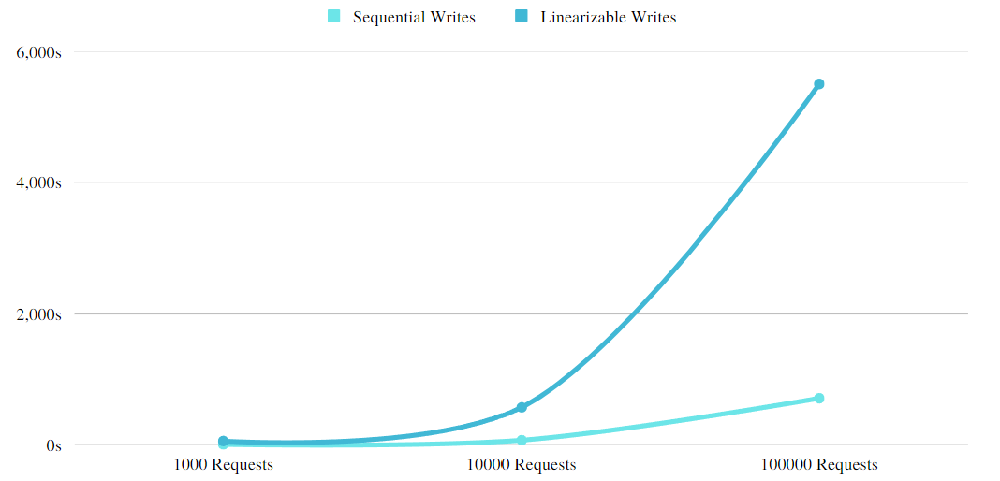

# Testing env

Since our project is using omni-paxos to emulate etcd, we chose to perform performance tests.
Our main test directions are read and write performance tests, single-threaded and multi-threaded, and performance comparison with etcd.
## Table of test cases

### Before testing

Before diving into testing details:

To have a stander VM to complete our testing, we decided to create an ec2 instance in AWS. The congiruation is:  

- Image: Canonical, Ubuntu, 22.04 LTS, amd64 jammy image build on 2023-02-08  
- Instance type: t2 micro with 1 CPU and 1 RAM
- Storage size: 30 GB

Besides the testing machine, we set define several rules and secnrial.

- Size of Key and value is 24 bytes.
- Use different amount of requests in each batch, eg of 1,000, 10,000, 100,000.  

> We wanted to test 100,0000 requests, but we gave up because the performance is not very strong and it's very time consuming.

### Tools used in testing

#### etcd

First, we need to set up an etcd cluster, we used **goreman** to start our cluster. The tool enables us to start a multi-member cluster by executing a Procfile file with a few commands (1 command `./goreman -f Procfile start`).

> go must be installed first
> Execute `go install github.com/mattn/goreman@latest`  
> The Procfile file here is the Procfile file from the root of etcd's gitub project, but it needs to be modified by changing bin/etcd to etcd

The started members are each listening for client requests on localhost:12379, localhost:22379, and localhost:32379.

Next, test the it with the official Benchmark CLI tool from etcd. Can be found at
[Benchmark](https://github.com/etcd-io/etcd/tree/v3.4.16/tools/benchmark)

#### DDBB

#### Test Cases

##### The impact of cluster size on read and write performance

We first divide into 2 broad categories to determine if the size of the cluster affects performance, which are 3 nodes and 5 nodes

As can be seen in the figure, the size of the cluster has almost no effect on reads. For writes, there is some impact, especially linearizable writes, but the impact is within 5% of the acceptable range.

##### The impact of request size on performance

Because Lin's read and write transitions are time consuming when the request size is 100000 and would interfere with viewing if added to the graph, only their values can be marked. Through several tests, we found that the read and write performance grows linearly and almost in proportion to the ratio between requests.

##### Serializable and Linearizable

In our tests, Linearizable write and read take a lot of time, about 4-5 times longer than seq. The main reasons for this are Linearizable read requests go through a quorum of cluster members for consensus to fetch the most recent data. Serializable read requests are cheaper than linearizable reads since they are served by any single etcd member, instead of a quorum of members, in exchange for possibly serving stale data.

#### Single / Multiple Write Requests

Single threaded compared to multi-threaded,
Multi-threaded can save 1/3 of the time, and the time saved is more obvious when the access volume is large.

#### Maximum operation per unit time

After our testing, our DDBB can support writing 7000 records and reading 100000 data per minute with Serializable. To ensure Linearizable, the performance of our solution is significantly lower.
This test is performed by using the process sleep time sleep(Duration::from_millis(5)).await; the final minimum sleep time for a cluster of 5 nodes is 10 millis and 5 for 3 nodes to ensure no data loss.

#### DDBB and etcd comparison analysis

According to our results, with seq writes, we can achieve 30% of the speed of etcd in various seqs, and even faster reads than etcd in the case of seq reads.

However, when it comes to lin reads and writes, our performance becomes extremely poor. It can only reach about 5% of the performance of etcd, and 1/6 of the performance of etcd in the multi-threaded case.  

One of the reasons is that we have to let the threads sleep for a while to make sure that the data can be stored and read without errors. This is the main area of improvement for us in the future

#### Partical connectivties

[To-Do]